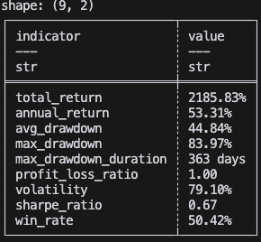
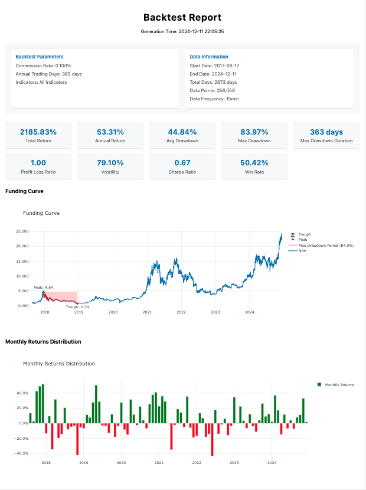
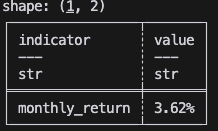
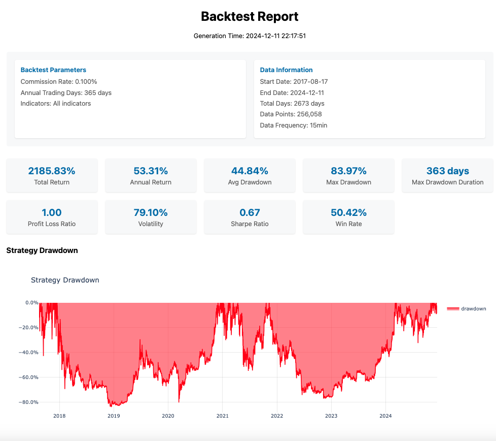

# PositionBT

PositionBT 是一个专注于基于仓位数据进行策略回测的 Python 库。这个库的设计理念是"简单即是美"，致力于提供一个轻量级但功能强大的回测框架。
> 注意：当前版本仅支持单个交易品种的回测。多品种回测功能正在开发中，将在未来版本中推出。

## 特点

* 简单易用
  - 有别于传统回测框架需要处理繁琐的订单、手续费和滑点模型，PositionBT 采用规范化的仓位数据进行回测，大幅简化了使用流程。
  - 仓位采用标准化设计，从 -1（满仓做空）到 1（满仓做多）的直观刻度，让策略评估更加清晰明确。
  - 专注于策略核心逻辑的验证，避免在交易执行细节上耗费过多精力，提升策略研发效率。

* 高性能
  - 基于 Polars 构建，提供极速的数据处理能力。
  - 优化计算流程，避免重复计算，提高回测效率。

* 可视化
  - 集成 `plotly` 打造专业的可视化模块，提供丰富的交互式分析功能。
  - 支持多种查看方式：可通过浏览器实时预览回测报告，或导出为 HTML 文件便于分享与存档。

* 可扩展性
  - 灵活的指标系统：支持自定义性能评估指标。
  - 丰富的可视化选项：支持自定义图表类型，可实现策略绩效曲线、回撤分析、持仓分布等多维度分析展示。
  - 开放的接口设计：便于用户扩展和集成自己的分析工具，打造个性化的回测分析流程。

## 性能测试

为了展示 PositionBT 的性能表现，我们使用了一个真实的大规模数据集进行测试：

### 测试数据集

* 文件：data/btc_ohlcv_1m.parquet
* 时间范围：2017年8月17日 至 2024年12月22日
* 数据类型：1分钟K线数据
* 数据量：2,682,218条记录

### 测试环境

* 硬件：Mac Mini (M4芯片)
* 内存：16 GB
* 硬盘：256 GB

### 性能结果

* 回测耗时：0.14 秒
* 数据处理速度：19,158,700 条/秒

这个测试结果表明，PositionBT 能够高效处理大规模的历史数据，为策略验证提供快速的反馈。即使面对数百万级别的数据量，其性能表现依然保持稳定。

> 注：测试结果可能会因硬件配置和数据特征而有所差异。

## 安装

```bash
pip install positionbt
```

## 快速开始

### 买入持有策略示例

#### 代码

下面展示了一个简单的策略回测示例：在整个回测期间保持 BTC 满仓多头持仓。这个示例演示了 PositionBT 的基本用法，包括数据加载、回测执行和结果可视化的完整流程。

```python
import polars as pl

from examples.data_loader import load_close_data
from positionbt import BacktestVisualizer, PositionBacktester

# Load BTC close data
close_df = load_close_data()

# Generate position data
position_df = close_df.select(pl.col("time")).with_columns(pl.lit(1).alias("position"))

# Initialize backtester with parameters
backtester = PositionBacktester(
    close_df=close_df,
    commission=0.001,  # 0.1% commission rate
    annual_trading_days=365,  # Use 365 trading days per year
    indicators="all",  # Calculate all available indicators
)

# Run backtest
backtest_result = backtester.run(position_df)

# Print backtest results in tabular format
backtest_result.print()

# Create visualizer and show results in browser
visualizer = BacktestVisualizer()
visualizer.show_in_browser(backtest_result, backtester.params)

```

#### 结果

回测结果：



回测报告：



### 自定义指标示例

#### 代码

PositionBT 支持自定义指标，用户可以根据需要添加自己的指标进行回测。打印回测结果，或者输出回测报告时，自定义指标会直接显示。

```python
import polars as pl

from examples.data_loader import load_close_data
from positionbt import BaseIndicator, PositionBacktester, indicator_registry


class MonthlyReturn(BaseIndicator):
    """Monthly return indicator"""

    @property
    def name(self) -> str:
        return "monthly_return"

    @property
    def requires(self) -> set[str]:
        # Depends on annual return
        return {"annual_return"}

    def calculate(self, cache: dict) -> float:
        """Calculate monthly return

        Calculation method:
        1. Convert from annual return
        2. Using formula: (1 + r_annual)^(1/12) - 1

        Args:
            cache: Dictionary containing calculation cache

        Returns:
            Monthly return value

        """
        if "monthly_return" not in cache:
            annual_return = cache["annual_return"]
            monthly_return = (1 + annual_return) ** (1 / 12) - 1
            cache["monthly_return"] = monthly_return

        return cache["monthly_return"]

    def format(self, value: float) -> str:
        """Format monthly return value as percentage

        Args:
            value: Monthly return value

        Returns:
            Formatted string with percentage

        """
        return f"{value:.2%}"


# Register custom indicator
indicator_registry.register(MonthlyReturn())

# Load close data
close_df = load_close_data()

# Generate position data
position_df = close_df.select(pl.col("time")).with_columns(pl.lit(1).alias("position"))

# Create backtester instance (using all indicators including the newly registered monthly return)
backtester = PositionBacktester(
    close_df=close_df,
    commission=0.001,  # 0.1% commission rate
    annual_trading_days=365,  # Use 365 trading days per year
    indicators=["monthly_return"],  # Use all registered indicators
)

# Run backtest
results = backtester.run(position_df)

# Print results
results.print()

```

#### 结果

回测结果：



### 自定义可视化示例

#### 代码

PositionBT 支持自定义可视化，用户可以根据需要添加自己的可视化模块。

```python
import plotly.graph_objects as go
import polars as pl

from examples.data_loader import load_close_data
from positionbt import (
    BacktestVisualizer,
    BaseFigure,
    PositionBacktester,
    figure_registry,
)


class DrawdownFigure(BaseFigure):
    """Drawdown visualization figure"""

    @property
    def name(self) -> str:
        return "drawdown"

    @property
    def title(self) -> str:
        return "Strategy Drawdown"

    def create(self) -> go.Figure:
        """Create drawdown figure

        Returns:
            Plotly figure object containing drawdown visualization

        """
        # Calculate cumulative maximum of funding curve
        cummax = self.funding_curve.get_column("funding_curve").cum_max()

        # Calculate drawdown as percentage from peak
        drawdown = (self.funding_curve.get_column("funding_curve") - cummax) / cummax

        # Add drawdown trace to figure
        self._fig.add_trace(
            go.Scatter(
                x=self.funding_curve.get_column("time"),
                y=drawdown,
                fill="tozeroy",  # Fill area from line to zero
                name="drawdown",
                line=dict(color="red"),
            )
        )

        # Update layout with percentage formatting
        self._fig.update_layout(
            yaxis=dict(
                tickformat=".1%",  # Format y-axis ticks as percentages
                hoverformat=".2%",  # Format hover text as percentages
            ),
        )
        return self._fig


# Register custom figure
figure_registry.register(DrawdownFigure)

# Load close data
close_df = load_close_data()

# Generate position data
position_df = close_df.select(pl.col("time")).with_columns(pl.lit(1).alias("position"))


# Initialize backtester
backtester = PositionBacktester(
    close_df=close_df,
    commission=0.001,  # 0.1% commission rate
    annual_trading_days=365,  # Use 365 trading days per year
    indicators="all",  # Calculate all available indicators
)

# Run backtest
backtest_result = backtester.run(position_df)

# Create visualizer and show results in browser
visualizer = BacktestVisualizer(figures=["drawdown"])
visualizer.show_in_browser(backtest_result, backtester.params)
```

#### 结果

回测报告：



## 支持的指标

| 指标名称 | 说明 | 计算方法 | 展示格式 | 指标ID |
|---------|------|---------|----------|---------|
| 总收益率 (Total Return) | 策略整体收益表现 | 最终净值/初始净值 - 1 | 百分比 (xx.xx%) | total_return |
| 年化收益率 (Annual Return) | 收益率年化后的表现 | (1 + 总收益率)^(365/实际天数) - 1 | 百分比 (xx.xx%) | annual_return |
| 波动率 (Volatility) | 收益率的年化标准差 | 收益率标准差 * √(年化周期) | 百分比 (xx.xx%) | volatility |
| 夏普比率 (Sharpe Ratio) | 风险调整后收益指标 | 年化收益率/年化波动率 | 小数 (xx.xx) | sharpe_ratio |
| 最大回撤 (Max Drawdown) | 最大净值回撤幅度 | (历史最高点 - 当前净值)/历史最高点 的最大值 | 百分比 (xx.xx%) | max_drawdown |
| 最大回撤持续期 (Max Drawdown Duration) | 最大回撤的持续时间 | 最大回撤期间的天数 | xx 天 | max_drawdown_duration |
| 胜率 (Win Rate) | 盈利交易占比 | 盈利交易次数/总交易次数 | 百分比 (xx.xx%) | win_rate |
| 平均回撤 (Avg Drawdown) | 回撤的平均值 | 所有非零回撤的算术平均值 | 百分比 (xx.xx%) | avg_drawdown |
| 盈亏比 (Profit Loss Ratio) | 平均盈利与平均亏损之比 | \|平均盈利\|/\|平均亏损\| | 小数 (xx.xx) 或 ∞ | profit_loss_ratio |

> 注：所有百分比指标均保留两位小数，比率指标保留两位小数。

## 支持的可视化

## 回测报告组件

### 图表组件

| 图表名称 | 组件ID | 说明 | 主要特点 |
|---------|--------|------|----------|
| 净值曲线图 | funding_curve | 展示策略净值变化 | - 显示完整的净值走势<br>- 标注最大回撤区间<br>- 标记最大回撤的峰谷点<br>- 支持交互式缩放查看 |
| 月度收益分布图 | monthly_returns | 展示策略月度收益分布 | - 使用柱状图展示每月收益<br>- 红绿双色区分盈亏<br>- 支持收益率精确查看 |

### 信息面板

| 面板类型 | 展示内容 | 说明 |
|---------|---------|------|
| 回测参数信息 | - 手续费率<br>- 年化交易天数<br>- 使用的指标 | 展示回测的基本设置参数 |
| 数据信息 | - 起始日期<br>- 结束日期<br>- 总天数<br>- 数据点数<br>- 数据频率 | 展示回测数据的基本信息 |
| 绩效指标 | - 总收益率<br>- 年化收益率<br>- 夏普比率<br>- 最大回撤<br>- 其他核心指标 | 以卡片形式展示策略的关键绩效指标 |

> 注：所有图表组件都支持交互式操作，可以放大、缩小、平移和导出图片。报告以 HTML 格式生成，可以通过浏览器直接查看或保存成 HTML 文件。

## API 参考

### 核心类

#### PositionBacktester
回测引擎的主类，用于执行策略回测。

```python
PositionBacktester(
    close_df: pl.DataFrame,
    commission: float = 0.001,
    annual_trading_days: int = 252,
    indicators: Union[str, list[str]] = "all"
)
```

**参数说明：**
- `close_df`: 包含 `time` 和 `close` 列的 Polars DataFrame
- `commission`: 交易手续费率，默认 0.1%
- `annual_trading_days`: 年化天数，默认 252
- `indicators`: 需要计算的指标，可以是 "all" 或指标名称列表

**主要方法：**
- `run(position_df: pl.DataFrame) -> BacktestResult`: 执行回测并返回结果

#### BacktestResult
回测结果的数据类，包含回测的所有结果数据。

**主要属性：**
- `funding_curve`: 净值曲线数据
- `indicator_values`: 指标计算结果
- `formatted_indicator_values`: 格式化后的指标值

**主要方法：**
- `print()`: 以表格形式打印回测结果

#### BacktestVisualizer
回测结果可视化器，用于生成交互式回测报告。

```python
BacktestVisualizer(
    figures: Optional[list[str]] = None
)
```

**参数说明：**
- `figures`: 需要展示的图表列表（可选）

**主要方法：**
- `show_in_browser(results: BacktestResult, params: dict, notes: Optional[str] = None)`: 在浏览器中展示回测报告
- `generate_html_report(results: BacktestResult, params: dict, output_path: str, notes: Optional[str] = None)`: 生成 HTML 格式的回测报告

### 基类

#### BaseIndicator
指标计算的基类，用于自定义新的性能指标。

**必须实现的方法：**
- `name(self) -> str`: 返回指标名称
- `calculate(self, cache: dict) -> float`: 计算指标值
- `format(self, value: float) -> str`: 格式化指标值

**非必须实现的方法：**

* `requires(self) -> set[str]`: 依赖的指标

#### BaseFigure
可视化图表的基类，用于自定义新的图表类型。

**必须实现的方法：**
- `name(self) -> str`: 返回图表唯一标识符（需使用 @property 装饰器）
- `title(self) -> str`: 返回图表显示标题（需使用 @property 装饰器）
- `create(self) -> go.Figure`: 创建并返回 Plotly 图表对象

**初始化参数：**
- `results`: BacktestResult 对象，包含回测结果数据

**可用属性：**
- `results`: 回测结果对象
- `funding_curve`: 净值曲线数据
- `_fig`: 基础图表对象（包含默认布局设置）

### 注册器

#### indicator_registry
指标注册器，用于管理和获取可用的性能指标。

**主要方法：**
- `register(indicator_cls: Type[BaseIndicator])`: 注册新的指标
- `get(name: str) -> Type[BaseIndicator]`: 获取指标类
- `available_indicators`: 获取所有可用指标列表

#### figure_registry
图表注册器，用于管理和获取可用的可视化图表。

**主要方法：**
- `register(figure_cls: Type[BaseFigure])`: 注册新的图表
- `get(name: str) -> Type[BaseFigure]`: 获取图表类
- `available_figures`: 获取所有可用图表列表
